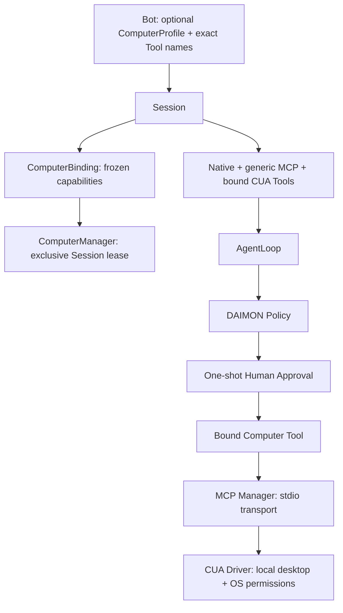

# Computer Use v1 — Phase 12

Computer Use is an explicit optional Bot capability. A Computer is the local
desktop, its availability, a Session binding and an exclusive control lease. A
Tool is one operation. CUA supplies primitives; it does not authorize an agent.
AgentLoop still executes sequentially after the whole batch has been authorized.
Native tools remain the preferred path for structured workspace work.

## Audit and ownership

The Phase 0–11 baseline already supplies provider-independent Model.Generate,
Tool.Execute, Registry, typed events, per-call web approval, persistent Bots and
Threads, private user/assistant transcript, manual contextual Memory and bounded
MCP stdio. Generic MCP v1 admits approved reads only. The Computer adapter is a
separate capability boundary; it does not make generic MCP writes permissible.

`internal/computer` owns Profile, Backend, CUA, capabilities, Manager and Binding.
Model and AgentLoop do not import it. `Backend` exposes ID, metadata Probe and
exact operation Resolve. Manager owns Open, admission, binding lifecycle and
exclusive physical desktop access. Only CUA Local is implemented. Operation
handles, process clients, call arguments and screenshots are private runtime data.



## Public CUA integration and selected protocol

The official [CUA MCP CLI](https://cua.ai/docs/cua-driver/reference/cli/mcp)
provides `cua-driver mcp`. Its public
[protocol contract](https://github.com/trycua/cua/blob/main/libs/cua-driver/docs/mcp-protocol-and-skills.md)
documents legacy initialize **2025-06-18** alongside a different modern discovery
profile. DAIMON explicitly selects that legacy version for `cua-local`; ordinary
MCP servers retain **2025-11-25**. No retry, negotiation fallback, modern protocol
implementation, SDK dependency or copied CUA implementation is introduced.

Initialization, initialized notification, tools/list, tools/call, cancellation,
body/schema/result limits, stderr disposal, process ownership and shutdown all
reuse `internal/mcp`. A protocol mismatch retires the server. Generic MCP Lookup
and its catalog's permitted flag deny every tool on the designated CUA server,
even if locally classified read. Only Computer resolution can obtain transport
handles, and only bound tools enter the per-Session Registry.

## Manual installation and local configuration

Install CUA yourself using its official instructions and grant the required OS
permissions. DAIMON never downloads, installs, updates, elevates, watches or
automatically restarts the driver. Its existing process transport supports
Windows and Linux; other platforms fail closed. CUA's own platform support does
not establish DAIMON compatibility. No real desktop smoke was performed here.

Use the existing local `mcp.json`, not another config file:

```json
{
  "version": 1,
  "servers": [{
    "id": "cua",
    "computer_backend": "cua-local",
    "command": "/absolute/manual/install/cua-driver",
    "args": ["mcp"],
    "enabled": true,
    "tools": {
      "list_apps": {"classification": "read"},
      "list_windows": {"classification": "read"},
      "get_window_state": {"classification": "read"},
      "get_accessibility_tree": {"classification": "read"},
      "click": {"classification": "write"},
      "type_text": {"classification": "write"},
      "bring_to_front": {"classification": "write"}
    }
  }]
}
```

On Windows use an absolute JSON-escaped path ending in `cua-driver.exe`. Exactly
one designated local Computer server is accepted, including disabled entries;
additional aliases cannot create independent leases for one physical desktop.
Only argv `["mcp"]` and the expected executable basename are admitted. A trusted
`cua-driver` command without its Computer designation is refused. Trusting a local
executable remains an administrator responsibility; names do not prove its safety.
Existing MCP config without Computer fields remains compatible.

Status distinguishes configured/disabled, executable_missing, startup_failed,
connected and unavailable after retirement. Health reads only transport metadata;
it never invokes an observation tool. Absence of a Computer configuration returns
an empty catalog. Fix installation/configuration and restart DAIMON deliberately.

## Bot schema and frozen Session binding

Bot Store version 1 accepts a compatible optional extension:

```json
"computer_profile": {
  "enabled": true,
  "backend": "cua-local",
  "mcp_server_id": "cua"
}
```

When present all three exact keys are required; unknown/duplicate/case-altered
keys, null, unsupported backends and invalid IDs fail closed. Old Bots omit this
field and behave as before. Clone copies the optional profile. Bot.Tools still
declares exact `mcp__cua__...` names; enabling Computer supplies no default tools.
An absent/disabled profile cannot use CUA names through generic MCP. Retained CUA
declarations with a disabled profile fail resolution; remove those declarations
to run only native/generic tools. Memory, transcript text and instructions cannot
create a profile, tool registration, grant, permission or lease.

Session resolution copies configuration, resolves the exact local/discovered
intersection and acquires a lease before model execution. Read-only mode admits
only observe operations. Unavailable/unsupported declarations fail before model
construction; partial resolution releases its lease. Bound capabilities stay
fixed for the run. Bot edits affect future resolutions. The private binding owns
resources; public Snapshot contains optional Computer ID, backend ID and copied
capability IDs only. These are historical binding metadata, not live health or an
input handle. No profile/commands/arguments/window handles/images enter snapshots.
Computer v1 is assembled by `serve` with its existing web approval adapter. Other
Session callers without that deliberate Computer presenter fail closed.

## Exact capabilities and argument subset

Names come from the official
[app/window catalog](https://cua.ai/docs/cua-driver/reference/mcp-tools/apps-and-windows),
[window-state catalog](https://cua.ai/docs/cua-driver/reference/mcp-tools/window-state),
[click](https://cua.ai/docs/cua-driver/reference/mcp-tools/click),
[typing](https://cua.ai/docs/cua-driver/reference/mcp-tools/keyboard) and
[screen catalog](https://cua.ai/docs/cua-driver/reference/mcp-tools/screen).
Discovery supplies exact names and bounded schemas; local mapping and argument
validation supply the capability boundary. Remote annotations cannot authorize.

| Class | Actual names | v1 eligibility |
| --- | --- | --- |
| observe | list_apps, list_windows, get_window_state, get_accessibility_tree | Approved textual observations; local config must say read |
| observe | debug_window_info, get_desktop_state, get_screen_size, get_cursor_position, zoom | Classified but unsupported; no capture operation registered |
| navigate | click, bring_to_front | Individual approval; local config must say write |
| navigate | set_window_frame | Classified but unsupported |
| input | type_text | Individual approval with full typing preview; local write |
| input | press_key, hotkey | Classified but unsupported |
| system | launch_app | Classified but unsupported; no generic process launch |
| dangerous | kill_app, invoke_menu, all unknown names | Denied |

Only the seven supported names above are admitted. No substring heuristics,
wildcards, provider-selected permission mode or remote classification grants.
Provider tool descriptions/schemas describe the local supported argument subset.
Nonempty target is mandatory for window actions: positive pid/window_id or a
bounded element_token where supported. Coordinate click requires both x/y and
pid/window_id; it may be refused by CUA without a matching capture context. Prefer
AX element tokens from textual state. No desktop-wide input scope is enabled.

Strict validation rejects duplicates/null, unsupported fields, out-of-range
numbers, absent targets, output paths, batch actions, raw scripts and driver session
overrides. get_window_state requires explicit `include_screenshot:false` and
cannot disable its accessibility tree. Text is UTF-8, at most 16 KiB; other string
arguments are at most 256 bytes. MCP and Loop budgets remain authoritative.

## Policy and human review

Every supported operation, including observation, requires individual human
approval. Selection is eligibility, never authorization. Existing whole-batch
preauthorization, per-call identity, default deny, abort/deadline invalidation,
duplicate rejection and no permanent approval semantics remain unchanged.

The deliberate Computer presentation identifies local Computer/backend, exact
action class, operation and complete sanitized target. It does not dump raw JSON
arguments. Typing shows the full exact text with reversible ASCII escapes, never
a shortened preview. All text/targets are React-escaped. The human sees a warning
that this controls their real computer, observations go to the provider, and
cancellation cannot undo a completed action. Read approval never shows results.

The official [CUA permission model](https://cua.ai/docs/cua-driver/guides/permissions)
has independent runtime checks and OS permissions. DAIMON does not configure an
unrestricted mode, bypass flags or approval grants. Operational child environment
is explicitly selected by cmd: no inherited provider credentials. Generic MCP
keeps its existing eight operational variables. CUA additionally receives only
DISPLAY, WAYLAND_DISPLAY, XAUTHORITY, XDG_RUNTIME_DIR, DBUS_SESSION_BUS_ADDRESS, HOME,
USERPROFILE, APPDATA and LOCALAPPDATA when supplied by the caller. These identify
the existing graphical session and per-user OS directories, not provider settings.
Linux requires a working desktop and display/authentication setup, as documented
in the [manual installation guide](https://github.com/trycua/cua/blob/main/docs/content/docs/how-to-guides/driver/install.mdx).
Transport
rejects DAIMON_*, OPENAI_*, GROQ_*, ANTHROPIC_*, OPENROUTER_* and CUA_DRIVER_* env
names. Missing OS permission or a CUA denial remains a controlled tool failure.

## Screenshots and provider boundary

The current Model/provider contract is text-only. No multimodal protocol redesign
is included. Screenshot/zoom tools cannot resolve and get_window_state explicitly
disables screenshot capture. Unexpected MCP image/audio/resource blocks are
rejected. Each text block is checked before concatenation for image data URLs and
image/base64 objects. StructuredContent is not forwarded. Unsupported data is
discarded, producing fixed errors/receipts. No screenshot is stored in transcript,
Memory, logs, SSE, snapshots, approval previews or a browser viewer. Bounded raw
transport frames exist transiently during decoding only. Arbitrary external
programs are trusted code, not a content-sanitizing sandbox.

## Lease, cancellation and failure

One local physical computer is shared. ComputerManager grants one exclusive
Session lease throughout execution, including all observations and approval waits.
Another Thread receives computer_busy before its model runs. v1 conservatively
serializes reads as well as input. No waiting queue, stealing, takeover or retry.

Completion, denial followed by completion, abort, failure, partial resolution and
Manager.Close revoke the binding. Normal runtime cleanup releases before final
transcript persistence and terminal status publication. Close cancels an active operation and waits for
it to unwind before releasing the lease. If a close deadline expires, the lease
stays held until the operation exits; stale Tool handles cannot execute. Manager
shutdown rejects new bindings. Leases are ephemeral and never restored on restart.
This lease coordinates Sessions in one DAIMON process, not external applications,
other DAIMON processes or physical human input.

Transport crash/protocol failure marks CUA unavailable without restart. The call
returns a controlled failure; the loop may recover textually, and other providers,
workspaces, Memory and independent MCP servers remain unaffected. Cooperative
cancel/timeout retires the shared CUA connection, so future Computer sessions can
fail closed until manual restart. Effects already performed are not rolled back.
Shutdown order: HTTP → cancel/join Sessions → close Computer bindings → close/join
MCP clients/processes. CUA desktop actions do not inherit os.Root confinement.

## HTTP and UI

Only readonly Computer routes exist:

- GET /api/v1/computers → `{ "computers": [Info] }`.
- GET /api/v1/computers/{id} → Info, or controlled 404.

Info contains id, backend, fixed status, capability IDs/names/classes/eligibility,
busy and optional controller_session_id. It contains no process config, remote
schema, raw protocol, secrets, arguments, observation or image. No call/click/type/
launch/screenshot endpoint exists. POST/PUT/DELETE on metadata routes return 405;
action subroutes return 404. Host/Origin, body/query checks and no-store apply.
Bot CRUD adds the optional profile; Session POST cannot enable Computer.

Settings / Computer shows connected/missing/unavailable status, capabilities,
busy and manual setup instructions. Bot Editor explicitly enables Computer and
selects a configured CUA backend and eligible tools. Thread badge uses frozen
active binding metadata and manually refreshed status. Runtime activity preserves
existing typed lifecycle events without names, arguments, results or screenshots.
There is no live view, video/canvas, remote input or human takeover.

## Offline verification and limitations

The stdlib fake CUA executable uses the real MCP stdio transport and real public
tool names, with no desktop access. Tests cover strict profiles/configuration,
classification, unknown/unsupported actions, local argument bounds, escaped typing,
generic MCP bypass denial, availability, invalid discovery, image rejection,
crash/timeout/cancellation, concurrent admission, stale bindings and lease release.
Session tests cover observe/click/type approvals, deny/abort, public metadata,
history/Memory non-authority, unavailable capabilities and reuse after completion.
Phase 12 HTTP/UI tests cover readonly routes and exact optional profiles;
Phase 13 adds separate viewer tests.

Run the standard Linux gofmt/vet/test/race/demo commands in AGENTS.md, and ui npm
ci/typecheck/test/build. Optional offline browser commands:
`DAIMON_SMOKE_CHANNEL=msedge npm run smoke:computer` and
`DAIMON_SMOKE_CHANNEL=msedge node scripts/computer-smoke.mjs --missing`.
They use a cached Go Docker image, disposable fixture data, the embedded UI, real
Session/HTTP/MCP and a deterministic Model. Docker here is a test environment,
not a product Computer backend. They verify individual approvals, no premature
effect, busy/release/second Thread, denial, abort, unknown action, crash, persistent
assistant response, missing driver, and joined shutdown. No real provider/driver
credentials, internet service or real computer action is used.

Local Computer only; no sandbox guarantee, cloud, auto-install, automatic restart,
live view, human takeover, persistent computer grants or multimodal model support.
CUA Sandbox, CUA Spaces, Cloud Computers, Intelligent Memory, Subagents and External
Agents remain intentionally deferred. The Phase 12 next step was **Phase 13 — Live
Computer View + Human Takeover**, requiring its own explicit scope and approval.


## Phase 12 change inventory

This working tree already contained uncommitted earlier phases. This list covers
only this Computer addition; no commit, push or later phase was performed.

Created:

- internal/computer/types.go
- internal/computer/profile.go
- internal/computer/backend.go
- internal/computer/capabilities.go
- internal/computer/actions.go
- internal/computer/cua.go
- internal/computer/manager.go
- internal/computer/computer_test.go
- internal/computer/cua_test.go
- internal/mcp/computer.go
- internal/mcp/computer_test.go
- internal/mcp/cuatest/fixture.go
- internal/mcp/cuatest/build.go
- cmd/daimon/serve_computer_test.go
- internal/bots/computer_test.go
- internal/sessions/computer_test.go
- internal/server/computers.go
- internal/server/computers_test.go
- ui/src/components/ComputerPanel.tsx
- ui/src/components/ComputerPanel.test.tsx
- ui/src/api/computer.test.ts
- ui/scripts/cua-fixture/main.go
- ui/scripts/computer-smoke.mjs
- docs/COMPUTER_USE_V1.md

Changed:

- cmd/daimon/serve.go
- internal/mcp/config.go
- internal/mcp/client.go
- internal/mcp/tools.go
- internal/mcp/manager.go
- internal/bots/bot.go
- internal/bots/validate.go
- internal/bots/store.go
- internal/sessions/types.go
- internal/sessions/resolve.go
- internal/sessions/manager.go
- internal/sessions/errors.go
- internal/sessions/approval.go
- internal/sessions/approval_adapter.go
- internal/server/server.go
- internal/server/routes.go
- internal/server/json.go
- internal/server/dto.go
- ui/src/api/types.ts
- ui/src/api/client.ts
- ui/src/App.tsx
- ui/src/components/Editors.tsx
- ui/src/components/ApprovalPanel.tsx
- ui/package.json
- ui/scripts/approval-fixture/main.go
- internal/server/ui/index.html
- internal/server/ui/assets/index-C2MLqXFL.js
- AGENTS.md
- README.md
- docs/DAIMON_ARCHITECTURE_V2.md
- docs/MCP_V1.md
- docs/MEMORY_V1.md
- docs/SESSION_RUNTIME.md
- docs/HTTP_API_V1.md
- docs/WEB_UI_V1.md
- docs/WEB_APPROVAL_V1.md
- docs/SSE_V1.md

The UI build replaced the previous generated JS hash; the unchanged CSS hash
remains. Existing phase tests were preserved. Modal opening uses a layout effect
so the approval dialog becomes accessible when its presentation is committed.

## Phase 13 extension

The Phase 12 action plane remains unchanged. [Computer View v1](COMPUTER_VIEW_V1.md)
adds optional independent local media viewers and explicit human takeover;
ComputerManager owns the exclusive input gate. Live frames use dedicated
sockets and never enter Session SSE/history/Memory. Presence is not implemented.
Next recommended: Phase 14 Sandboxed Computers, intentionally unimplemented.

## Phase 14 sandbox Computers

Host and sandbox Computers share capability admission and individual approvals.
Sandbox actions use `mcp__sandbox__NAME`, scoped to one Session guest, with a
distinct `sandbox-*` Computer ID. Missing/stale guests never resolve to host.
SandboxManager owns disposable lifecycle; ComputerManager owns input semantics.
See [Sandbox Computers](SANDBOX_COMPUTERS_V1.md).
