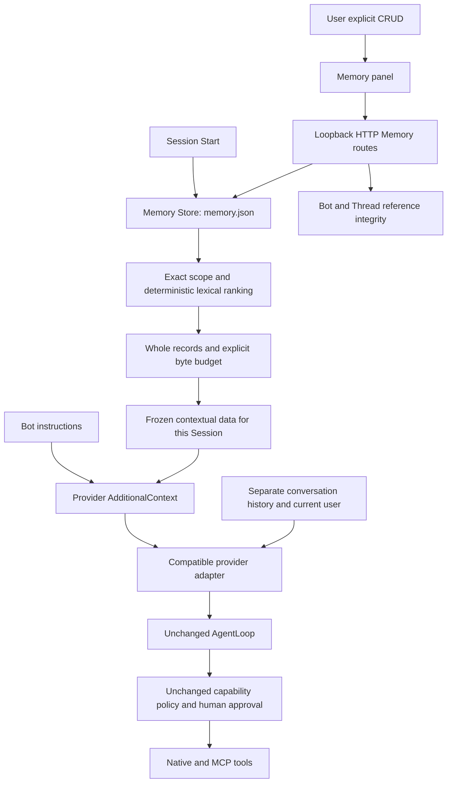
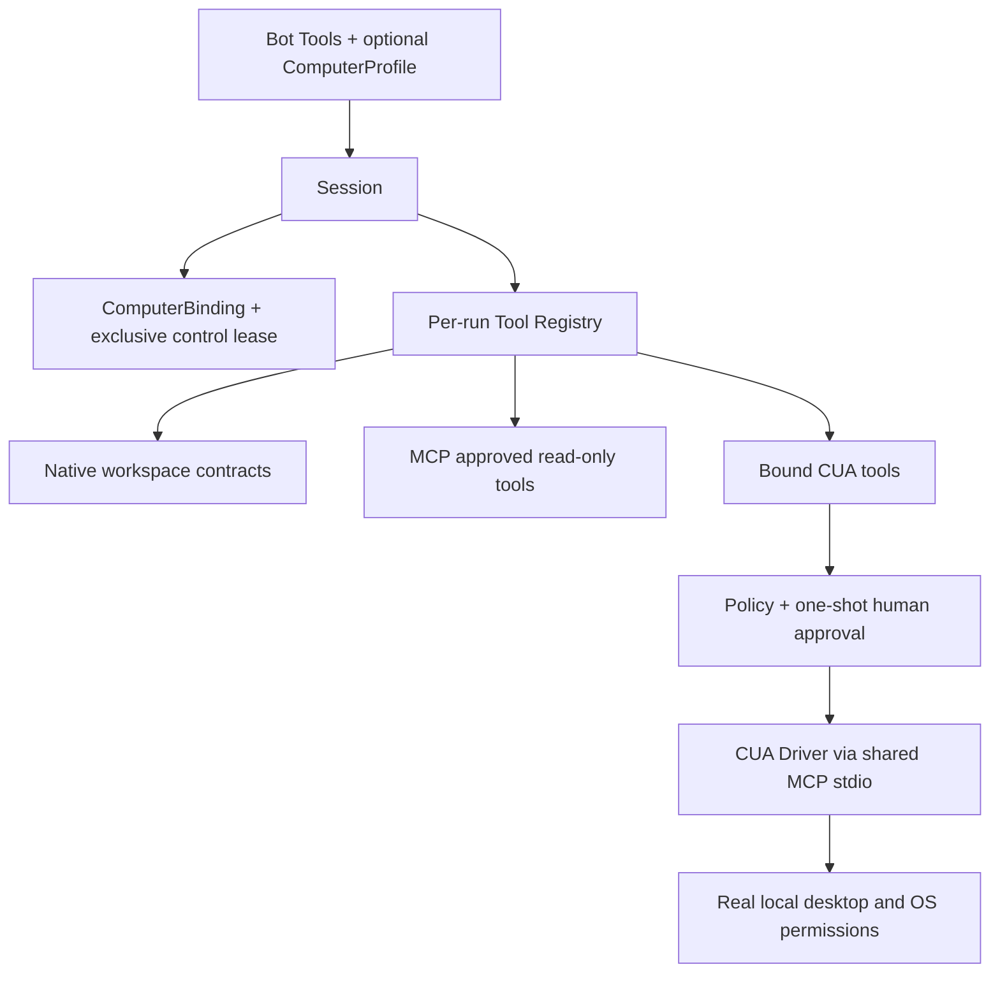

# DAIMON Architecture V2

Status: Phases 0–16 implemented through Session Runtime, local HTTP, SSE, Web UI
and persistent Conversation History/assistant responses, Web Approval, MCP tools,
explicit manual Memory, and local Computer Use through CUA. Future domains below
are design direction, not implemented APIs. This document supersedes temporary
scope prohibitions, never runtime safety contracts.

## 1. Product Vision

“DAIMON is not a model. DAIMON is the environment where models become agents.”

Daimon Bots is a local, provider-agnostic platform with a native Go runtime,
strong local execution contracts and user-controlled permissions. Intelligence
comes from external models. It is not a GitBot rewrite or a model implementation.
OpenAI, Anthropic, Gemini, OpenRouter, Groq, Ollama, LM Studio, vLLM,
llama.cpp servers, DeepSeek and Qwen are possible sources; listing them is not
a claim of native integration or verified protocol compatibility.

## 2. Current Architecture

Audit of the working tree, including pre-existing uncommitted changes:

| Module | Responsibility and dependencies | Assessment |
| --- | --- | --- |
| internal/model | Provider-independent messages, schemas, Model.Generate, defensive copies, Scripted | Reusable boundary |
| internal/bots | Phase 2 reusable configuration, structural validation and explicit local store; references providers.ID only at the domain boundary | No execution or authorization integration |
| internal/threads | Phase 3 persisted conversation metadata and local store, BotID/workspace references | No Bot Store lookup, workspace open, history or Session |
| internal/sessions | Manager/lifecycle, per-run binding, assembly, cancellation, bounded events and injected conversation persistence | Metadata stays private from transcript content |
| internal/computer | Phase 12 explicit CUA local capabilities, availability, frozen binding and control lease | No model, loop, persistent grants, sandbox or generic MCP authority |
| internal/environments | Phase 16 durable Thread-owned workspace revisions, manifests, bounded staging and expected-revision commits | Independent of compute/History/Memory |
| internal/conversations | Phase 8 ordered immutable user/assistant transcript, strict bounded per-Thread store | No Memory, tools, runtime or provider execution |
| internal/memory | Phase 11 explicit manual records, local strict Store, exact scoped lexical retrieval and bounded framing | Context only; no execution, authority or automatic extraction |
| internal/server | Phase 5 local HTTP adapter, strict bounded JSON, store serialization and safe DTOs | Consumes domains/Manager; owns no agent execution |
| internal/agentloop | Synchronous bounded turns, batch validation/authorization, typed events, final validation and one tool-free recovery | Preserve orchestration |
| internal/tools | Ordered registry, echo, bounded os.Root reads, single-file writes through contracts; depends on model and contracts | Preserve execution boundary |
| internal/policy | Static fail-closed policy, workspace capabilities, terminal approvals; depends on loop/tools/contracts | Approval composition remains outside loop |
| internal/editcontract / createcontract | Immutable proposals, full reversible previews, one-use permits, Linux executors | Preserve independently |
| internal/diffview | Deliberate bounded review rendering | Reusable review surface |
| internal/providers/openai | Configurable non-streaming Chat Completions HTTP, protocol validation, bounded bodies and typed diagnostics | Already compatible, keep location |
| internal/providers/groq | Fixed endpoint/default model wrapper of openai | No duplicate transport |
| cmd/daimon | Command parsing, environment/secrets, model construction, terminal I/O, policies and summaries | Composition root; selection can move gradually |
| internal/workspacefs | Root binding and isolation assessment | Strong shared-tree mutation isolation remains blocked |
| internal/workspaceplan | Strict bounded versioned plan parser | Does not grant execution permission |
| internal/workspacejournal | Caller-injected metadata journal | Private operation records, not conversation persistence |
| internal/managedworkspace | Offline private Linux amd64 copies, reviewed apply/report and journal | Owner/same UID/admin trusted; no publication to source |

README and workspace documents describe features beyond the old AGENTS scope:
opt-in plan validation/recovery, diagnostic classification and managed copies.
These existing capabilities are retained. go.mod uses Go 1.27.1 and no external
dependencies. Linux CI checks formatting, vet, tests and race on push/PR.

Coupling/debt: CLI owns provider selection, workspace instructions and transport
error classification; terminal approval cannot serve a browser directly. Runtime
tool history is per run; explicit user/assistant transcript is persisted separately. Events omit sensitive data deliberately.
Existing journals/manifests are workspace artifacts, not a generic session store.
Renaming packages, generalizing storage or exposing event payloads now would add
risk without a Phase 1 need. Concurrent external filesystem mutation is a known
limitation, not fixed by this architectural redirection.

## 3. Target Architecture

```text
Web / CLI / other clients
          | HTTP + SSE (implemented local server and client Web UI)
Server: stores, session lifecycle, approval forwarding, bounded event buffer
          | explicit runtime composition
Runtime: agentloop -> tool registry -> policy/approval -> workspace contracts
          | model.Model
Providers: explicit registry -> factories -> external model adapters
```

Dependencies point inward: server and clients consume runtime contracts. The
runtime never imports provider selection, HTTP server code or UI components.
The current CLI can continue composing the runtime directly.

## 4. Core invariants

Preserve positive explicit budgets, byte accounting, overflow-safe whole-batch
reservation, accepted-history limits, defensive copies, cooperative deadlines,
typed context/error identity and exactly one stop event with StopReason.
Tools remain sequential without retries; whole-batch authorization precedes effects.
Approval is explicit, per call and fail-closed, including invalid/absent decisions.
No default broad permissions, hidden side effects or permission persistence.
The full detailed invariants in ../AGENTS.md remain authoritative.

## 5. Domain boundaries

Provider is a source/configuration identity. Model is an executable model.Model
instance for a selected source/model name. Bot is reusable behavioral configuration.
Thread is persistent conversation identity/metadata associated with a bot/workspace.
Conversation Store owns its user/assistant transcript; Session execution is ephemeral.
Session is an active turn lifecycle. None is interchangeable with another.

A provider ID conveys neither tool capability nor human approval. A model name is
opaque to the runtime; registry construction does not authenticate or discover it.

## 6. Provider architecture

Implemented: caller-owned sequential Registry, stable lowercase ASCII IDs
(1–64 bytes, first letter, remaining letters/digits/hyphen), explicit Register,
Get and lexically sorted copied IDs. Duplicate, invalid and unknown registrations
have typed RegistryError with errors.Is causes, omitting caller values.
Factories are copied values with a Build callback and New method. Registration
and lookup do no I/O; built-in construction does no network request.

Config carries BaseURL, APIKey, Model, SystemInstruction, MaxResponseBytes and
optional caller-owned HTTPClient. This is the minimum common contract for current
compatible providers, not a universal future schema. Native protocols can add
specific construction contracts later instead of growing a universal struct.
Config has no formatter/persistence; never log it or serialize credentials.
Registry entries retain construction functions, not configs or keys. Caller
factories must follow the same rule and must not capture credentials.

Decision: KEEP internal/providers/openai as the shared compatible transport.
CompatibleFactory(id) permits explicit custom endpoint configurations without
copying protocol code. Built-in IDs are openai and groq. GroqFactory retains
the Groq wrapper defaults and rejects unsupported BaseURL instead of ignoring it.
Phase 4 adds optional bounded SystemInstruction forwarding through the shared
adapter, without changing existing CLI defaults. Adapter errors pass through unchanged, preserving
existing classification and context identities.

CLI registers both factories explicitly and uses Get/New; environment parsing,
commands, defaults and secret handling remain at the composition root. Diagnostic
imports of openai remain until a real second protocol requires neutral categories.
No compatible package extraction or OpenRouter-specific wrapper is necessary now.
No auto-discovery, plugins, reflection, singleton, lock or fallback is added.
Phase 5 composition copies registry IDs/factories before concurrent use;
the source registry is not mutated while constructing dependencies.

## 7. Bot architecture

Implemented in internal/bots: Bot, structural Validate, Clone and a local JSON
Store with List/Get/Create/Update/Delete. Bot != Provider != Model != Thread !=
Session: a Bot is reusable data, not a running process or a model instance.

| Field | Contract |
| --- | --- |
| ID | Bot ID, required, same restricted 1–64-byte syntax as provider IDs |
| Name | Required nonblank UTF-8, at most 256 bytes |
| Description | Optional UTF-8, at most 2048 bytes |
| Instructions | Required nonblank UTF-8, at most 8192 bytes |
| ProviderID | providers.ID, validated by shared providers.ValidateID |
| Model | Required nonblank opaque UTF-8 name, at most 256 bytes |
| Tools | Explicit non-nil slice, 0–32 distinct names, declaration order retained |
| PermissionMode | Explicit ask or read-only; zero/unknown value rejected |

Tool names have 1–64 ASCII bytes: first lowercase letter, then lowercase letters,
digits, underscore or hyphen. No wildcard/aliases/case normalization. Empty []
means no requested tools; nil/missing/null is invalid so there is no implicit
capability default. Store List is sorted by Bot ID, not tool name. Clone and
store snapshots own their tool slices. Validation does not normalize any text.

Provider existence is future runtime resolution, distinct from structural ID
validation. Tool existence is also deferred: valid unavailable names are allowed
in configuration. No registry lookup/global is performed by Validate, and no
factory, Tool implementation, policy or agentloop dependency enters the Bot.
Model names are not queried or certified. Future runtime assembly must resolve
references and intersect capabilities with host policy; unknown availability
must never turn into an implicit permission grant.

ask/read-only remain declarative in Bot validation. Phase 4 interprets them only
while assembling Sessions; read-only does not authorize reads or relax write previews.
Tools declare what may be made available to the model, never what can execute
without policy/approval. Instructions are data, not authority or executable setup.
SetupInstructions/runtime configuration remain deferred until actually needed.
model, agentloop, tools and policy do not import bots. HTTP and Web UI consume Bot
metadata through adapters; neither domain nor browser owns Session assembly.

Store takes an explicit file path, with an existing caller-controlled parent;
it never reads HOME, chooses ~/.daimon or creates parent directories. NewStore
validates an existing file without writing it. A missing file is an empty store:
List returns [], Get/Update/Delete return ErrNotFound, Create writes the first
envelope. Create rejects duplicates, Update/Delete require existence. Each
operation rereads disk, validates all records and returns owned values; no cache,
implicit recovery, permissions migration or global registry exists.

Serialization is exact version 1 with lowercase schema keys:

```json
{
  "version": 1,
  "bots": [{
    "id": "coder",
    "name": "Daimon Coder",
    "instructions": "Use evidence and request approval for effects.",
    "provider_id": "groq",
    "model": "openai/gpt-oss-20b",
    "tools": ["read_file", "list_dir"],
    "permission_mode": "ask"
  }]
}
```

Description may be absent. All other Bot fields and envelope fields are required.
Strict decoding rejects malformed JSON, invalid UTF-8, duplicate keys/IDs, null,
unknown or differently cased keys, trailing JSON, invalid Bots and unsupported
versions. No migration framework or silent migration. Limits: 128 Bots, 2 MiB
serialized file and bounded JSON nesting (four levels below root). Escaped JSON
size is checked before creating a temporary. ValidationError contains only a
controlled field; StoreError omits paths/text/underlying error messages and
preserves identity through errors.Is/As/Unwrap. Do not log raw causes.

Persistence writes an exclusive random temporary in the same directory, chmod
0600, complete Write, Sync and Close, then os.Rename. Existing files are never
truncated. Failed commits clean up the temporary; cleanup failure is explicit
ErrCleanup, not success. Observed symlink/nonregular targets are rejected. Store
is internal state, independent of editcontract/createcontract and their reviews.
No OS-specific executor or dependency is needed; CRUD works on Windows as well
as Linux. Permission bits are enforced by POSIX systems; Windows requires a
caller-controlled private directory/ACL. os.Rename is not promised atomic on
Windows, and directory durability is not promised on any platform.

Use sequentially with one writer in a controlled directory/ancestor chain. No
cross-process lock, lost-update detection, hostile symlink-race isolation, crash
recovery or concurrent-writer guarantee is implemented. Phase 5 establishes
in-process serialization through shared adapters. Bot schema has no API key,
endpoint, token, HTTP client or factory field. Free text can still contain data
supplied by a caller: never insert secrets; the schema cannot detect arbitrary
secrets in prose. Stored instructions/descriptions are private configuration.

## 8. Thread architecture

Implemented in internal/threads: Thread, structural Validate, typed errors and
explicit local Store with Create/Get/List/Update/Delete. Thread != Session:
Thread is persisted metadata, never a process, active turn, stream or agentloop.

```text
Bot Store
   |
   v
  Bot
   | logical reference only (no store dependency/automatic resolution)
   v
Thread Store
   |
   v
 Thread
   +-- BotID
   +-- Workspace
```

| Field | Contract |
| --- | --- |
| ID | Distinct threads.ID; required restricted 1–64-byte identifier |
| BotID | bots.ID; required shared restricted ID syntax, existence unresolved |
| Workspace | Required nonblank UTF-8, <=4096 bytes, no NUL; opaque exact reference |
| Title | Optional UTF-8, <=256 bytes; empty accepted, no generation |
| CreatedAt | Caller-provided nonzero UTC time.Time |
| UpdatedAt | Caller-provided nonzero UTC time.Time, >=CreatedAt |

IDs follow the existing providers.ValidateID structural contract: lowercase
letter first, then lowercase letters/digits/hyphen. Thread uses its own ID type.
Workspace validation does not call filepath.Abs, clean paths, follow symlinks,
open directories, resolve cwd or check access. Relative/absolute/platform-specific
references can be saved verbatim; future assembly must explicitly resolve them
under its own workspace policy. Saving a reference never grants filesystem access.
Bot existence is likewise runtime resolution; no automatic cross-store validation.

Timestamps must have zero UTC offset and years 1–9999 for JSON serialization;
zero/nonzero-offset values and reversed ordering are rejected. Zero-offset aliases
are accepted as UTC instants. RFC3339 timestamps use time.Time's standard JSON
encoding with fractional precision when present. The store preserves supplied
instants, never reads time.Now or invents creation/update times. JSON does not
persist Go's monotonic clock component or location names. No constructor/clock
abstraction is necessary while callers supply complete values.

Create rejects duplicate IDs. Update selects an existing ID and cannot rename it:
an unavailable ID returns ErrNotFound. BotID, exact Workspace and CreatedAt are
immutable after creation; attempted retargeting returns typed ErrImmutable.
UpdatedAt cannot precede the stored UpdatedAt (ErrInvalid); equality is allowed.
Only title/update metadata can change through Update. All Thread fields are
values with no maps/slices; Get values and sorted List snapshots are independent.

Snapshot decision: Phase 3 stores only BotID, without copying provider/model,
instructions, tools or permissions. The reference is unresolved metadata, not a
promise of conversation-wide configuration continuity. Phase 4 binds the current
Bot per Session: a running execution never changes, but a later Session can use
an edited Bot. Missing Bots fail startup. Conversation-wide snapshot/rebind
semantics resolve current Bot per turn in Phase 8; Thread itself stores no snapshot.

History decision: Phase 8 owns user/assistant messages in separate per-Thread
Conversation Store, not threads.json. No provider session IDs, summaries, tool
results or semantic Memory are persisted. Local UI loads the deliberate paginated
transcript endpoint. Each next Session receives bounded whole-message context.

The store takes an explicit filename in an existing controlled parent directory,
does not read HOME or create directories, and rereads/validates all disk data on
every operation. Missing file = empty collection; List returns [], Get/Update/
Delete return ErrNotFound, and Create persists the first record. NewStore validates
existing contents without writing. Strict version 1 envelope:

```json
{
  "version": 1,
  "threads": [{
    "id": "conversation-a",
    "bot_id": "coder",
    "workspace": "/explicit/workspace",
    "title": "",
    "created_at": "2026-10-07T12:00:00Z",
    "updated_at": "2026-10-07T12:00:00Z"
  }]
}
```

Title can be omitted on input and is emitted explicitly on save. Other fields
are required. Unsupported versions, malformed/invalid UTF-8 JSON, unknown or
differently cased keys, null, duplicate keys/IDs, trailing JSON, bad timestamps
and invalid records are rejected without recovery/migration. Limits: 256 Threads,
2 MiB serialized file and a bounded JSON token pass. ValidationError exposes only
a controlled field; StoreError excludes path/title/data/cause text while preserving
error identity. Schema has no credentials/provider config; callers must never
put secrets in free text. Titles/workspace references are private metadata.

Persistence follows the Bot Store pattern independently of user edit contracts:
exclusive temporary in the same directory, chmod 0600, Write/Sync/Close, rename,
explicit failed cleanup. Observed symlink/nonregular targets are refused; a failed
commit preserves the previous file without truncation. Sequential single writer,
no locks, cache, watcher or concurrent process exclusion. Works on Windows and
Linux; POSIX permissions apply where supported, Windows privacy relies on caller
ACLs. No Windows atomicity, hostile ancestor-race isolation or directory durability
is promised. The small domain-specific store avoids changing Bot Store or adding
a speculative generic persistence framework.

## 9. Session architecture

Implemented in internal/sessions: explicit dependencies/options, in-memory Manager,
asynchronous Start, Get, private Binding accessor, Wait, Abort, Close and EventsSince.
Detailed contracts, failure semantics and limits: [Session Runtime](SESSION_RUNTIME.md).

```text
Bot Store -> Bot ----+
                    |
Thread Store -> Thread -> Session Manager
                           +-- Binding / Lifecycle
                           +-- Cancellation / Event Buffer
                           |
                           v
                        AgentLoop
                           +-- Model / Provider factory
                           +-- Tools / Policy / Approval
                           +-- Explicit Workspace
```

Lifecycle: created -> running/failed/aborted; running -> waiting_approval/completed/
failed/aborted; waiting_approval -> running/failed/aborted. Terminal sessions cannot
restart. Binding snapshots BotID/ProviderID/model/instructions/tools/permission mode
per run, without credentials or live resources. One active session per Thread,
including startup and cleanup; different Threads can execute concurrently.

Registry is copied before concurrency. Resolvers and readers are explicitly injected,
fail closed and are called outside manager locks. Runtime root must be absolute,
opened/revalidated through existing workspacefs/os.Root boundaries. Only declared
built-in tools enter the model registry. read-only only resolves reads; ask preserves
policy. Writes require explicit per-Start opt-in, Linux and full one-use review.

Positive Budget, event capacity (1–16384) and retained-session capacity (1–1024) are
explicit. Ring replay uses increasing sequences and reports gaps. Approval state
comes from existing typed events; no second event system or approval queue.
Abort is cooperative context cancellation; Close stops admission and joins workers.
Loop budget starts at Run; startup uses caller context/deadline. Component guards
redact/recover panics at the async boundary without changing core loop semantics.

Snapshots contain IDs/status/times, binding IDs/mode/count, counters/StopReason and
whitelisted error category. They omit instructions/model text/workspace/tool names,
message, final text, results, history and secrets. Wait's typed error preserves
private cause identity without displaying it. Binding is a deliberate private surface.
No sessions.json, Session resume or automatic Thread update. Phase 8 transcript
belongs to an independently injected ConversationStore. Phase 5 provides
HTTP transport and serve assembly; Session domain itself has no CLI/UI responsibility.
Process restart loses Sessions/buffers; Bot/Thread metadata and transcript survive.

## 10. Server architecture

Implemented `daimon serve`: loopback-only 127.0.0.1:3000, --port and --data-dir,
stdlib net/http. Full API schemas/limits: [HTTP API v1](HTTP_API_V1.md).

```text
Web UI: Bots | Threads | Runtime Console
       | REST /api/v1 + SSE
       v
Local Server
 +-- Health / Provider IDs
 +-- Bots API / Threads API -> serialized domain stores
 +-- Sessions API / JSON event polling
       |
       v
Session Manager -> existing Runtime -> AgentLoop
```

Routes: GET health/providers; GET/POST bots/threads; GET/PUT/DELETE by ID;
POST sessions; GET sessions/{id}; POST sessions/{id}/abort; GET sessions/{id}/events.
All routes use /api/v1. Strict bounded requests, classified safe errors, explicit
output projections and no secret/body logging. No models, credentials, Binding,
Wait endpoint. Phase 9 adds deliberate pending/decision endpoints. Bot outputs omit instructions; Thread CRUD deliberately
shows configured workspace, while session/events/error outputs omit it.

Application owns Manager; HTTP admission uses application context rather than
request lifetime. Shared store adapters serialize CRUD and resolution. Registry
IDs/factories are frozen before concurrency. CLI uses existing provider environment
for key/endpoint, Bot for model/instructions, and uses individual Web approvals. HTTP exposes
no write opt-in. SIGINT/SIGTERM drain HTTP then Close/join Manager within 10 seconds.
No authentication/CORS/public bind; only trusted local clients. Phase 7 network
admission validates loopback Host, exact Origin and Fetch Metadata; static assets
have a same-origin CSP. These checks do not authorize local processes. Provider HTTP and
server HTTP remain separate boundaries; core has no import of server.

## 11. Event architecture

Existing typed EventSink remains the semantic origin:

```text
AgentLoop
   |
   v
Session Event Buffer (source of truth)
   +-- JSON polling via EventsSince
   +-- SSE via ObserveEvents + EventsSince
          |
          v
       Local Client
```

Implemented transport envelopes carry Session sequence IDs without
adding prompts, names, model IDs, arguments, paths, results or free-form errors to
loop events. Deliberate chat/approval displays need separate private authorized
surfaces. SSE is event transport, not provider token streaming. Phase 6 implements
GET /api/v1/sessions/{id}/events/stream, Last-Event-ID precedence over after, explicit
replay_gap followed by retained events, 15s heartbeats, terminal stream_end/EOF and
request/shutdown interruption. ObserveEvents atomically captures a shared generation
channel before replay, closing/renewing on Record and closing at final publication;
no subscription queues or lost replay-to-wait wakeups. EventsSince is unchanged.
64 global streams, 4096-byte payloads and refreshed 5s write/flush deadlines bound
observation. Disconnect never aborts Session; HTTP Shutdown signals streams before
draining and CLI Manager.Close. No second loop event system or global emitter.
Protocol and reconnection details: [SSE v1](SSE_V1.md).

## 12. Persistence strategy

Phase 1 added no persistence. Phases 2–3 add explicit versioned Bot and Thread
metadata stores described above, without conversation history. Later local stores may include
providers.json (non-secret metadata), bots.json and threads.json under a configured
private directory; SQLite only when justified. Separate store interfaces from
domain values at the phase that needs them. Define atomic update, permissions,
schema migration, corruption handling and data limits before writing stores.
Keys remain explicitly injected until a separately reviewed secret mechanism exists.
Existing managed-workspace manifests/journal remain distinct and unchanged.

## 13. Security boundaries

Providers only translate requests; never execute tools. Remote HTTPS, loopback-only
HTTP, URL restrictions, default redirect rejection, bounded/closed bodies, typed
redacted errors and caller context remain unchanged. Only cmd reads current
DAIMON environment variables. No real-service request is part of this task.

Workspace roots, traversal checks, symlink/hardlink checks, exact bound bytes,
complete ASCII previews, one-use permits, deadlines and explicit cleanup failures
remain unchanged. Replacement uses exclusive temporary/sync/close/rename; creation
uses O_EXCL and mode 0600, with partial visibility. Do not claim a sandbox, memory
ceiling, directory durability, Windows writes, hostile-writer exclusion or rollback.
Private managed copies trust owner/same UID/admin and never publish to source.

## 14. Migration map

| CURRENT | TARGET boundary | Action |
| --- | --- | --- |
| model | Core | KEEP Generate/messages and defensive copies |
| agentloop | Runtime | KEEP loop/budget/typed events; DO NOT TOUCH YET |
| tools, policy, edit/createcontract, diffview | Runtime | KEEP approval/execution contracts; DO NOT TOUCH YET |
| providers/openai, groq | Providers | KEEP adapters; EVOLVE explicit registry construction |
| workspacefs, workspaceplan, workspacejournal, managedworkspace | Runtime workspace | KEEP current guarantees/artifact scopes; DO NOT TOUCH YET |
| cmd/daimon | Client/composition | EVOLVE factory selection incrementally, preserve CLI |
| bots domain/validation/store | Core | KEEP Phase 2 data contracts; execution integration deferred |
| threads domain/validation/store | Core | KEEP Phase 3 metadata; execution/history belong to separate domains |
| sessions lifecycle/binding/buffer | Runtime orchestration | KEEP runtime API; Phase 8 adds injected transcript integration |
| HTTP server | Server | KEEP Phase 5 local transport; no execution logic |
| SSE | Server | KEEP Phase 6 bounded observation/replay transport |
| Browser UI | UI | KEEP Phase 7 static REST/SSE client, no execution authority |

## 15. Incremental roadmap

| Phase | Scope | Exit criterion before moving forward |
| --- | --- | --- |
| 0 Architecture Baseline | Audit, architecture, AGENTS, migration plan | Current behavior characterized; safety boundaries retained |
| 1 Provider Foundation | Identity, registry, config, shared compatible strategy | Offline registry/factory and CLI regressions pass |
| 2 Bot Domain (implemented) | Bot validation/store, provider/model/tool/permission references | Bounded structural config and explicit modes; no runtime resolution or effects |
| 3 Thread Domain (implemented) | Thread store, BotID/workspace links, timestamps | Strict bounded metadata, immutable associations; history/session binding deferred |
| 4 Session Runtime (implemented) | In-memory lifecycle, binding, assembly, cancel, bounded events/approval state | Offline resolution, concurrency/race, gaps and privacy tests; no conversation resume |
| 5 Server (implemented) | Local-only /api/v1 CRUD/session APIs and JSON polling | Offline strict/limited/privacy/loopback/lifecycle/race checks; no remote auth or UI |
| 6 Streaming (implemented) | SSE Session IDs, Last-Event-ID, reconnect and notification waiting | Gaps, disconnect independence, bounded streams/write deadlines and shutdown tested |
| 7 Web UI (implemented) | Bots/Threads CRUD, providers, local turns, Session start/abort and SSE console | Offline UI/API/SSE lifecycle and static browser-boundary tests; no web approval/history |
| 8 Conversation History + Response Persistence (implemented) | Bounded private history and actual assistant responses | Separate retention/privacy/ownership contracts and offline tests |
| 9 Web Approval Flow (implemented) | One-shot browser decisions through existing runtime providers/contracts | Offline lifecycle/security/privacy, Linux write and browser tests |
| 10 MCP Tool Integration (implemented) | Client/tool adapter, namespaces and explicit permissions | Untrusted tool metadata/results remain bounded and authorized |
| 11 Memory Foundation (implemented) | Explicit scoped manual Memory and deterministic contextual retrieval | Offline CRUD, budgets, isolation and privacy tests |
| 12 Computer Use Foundation (implemented) | CUA local via MCP, explicit Bot profile, one-shot approval and control lease | Offline process, Session, HTTP/UI and browser tests |
| 13 Live Computer View + Human Takeover (implemented) | Independent local media and exclusive explicit human input | Offline protocol, ownership, UI and browser validation |
| 14 Sandboxed Computers (deferred) | Sandboxed Computer backend | Separate explicit future scope |
| Future Intelligent Memory (deferred) | Extraction, summarization and semantic retrieval | Separate explicit future scope |
| Future Advanced Agents | Subagents, delegation, task graph, background jobs, external adapters | Separate reviewed authority/budget and execution boundaries |

Never implement a future phase before stabilizing and testing current contracts.
The workspace roadmap in workspace-core.md is separate; its blocked apply is not
unblocked by this product roadmap.

## 16. Non-goals

Phases 2–3 add Bot and Thread data/validation/stores only, with no execution or UI.
Phase 4 adds ephemeral internal Sessions. Phases 5–6 add local HTTP/SSE transport,
without history. Phase 7 adds client-only UI without MCP, Memory,
Subagents or External agents. No shell, arbitrary execution, new tools, database,
provider fallback/retry, streaming model protocol, discovery or dynamic plugins.
Codex/Claude Code/OpenCode may become optional external adapters in a future Advanced Agents phase,
never the foundation replacing the native runtime.

## 17. Compatibility strategy

Keep demo offline/Scripted; chat/workspace configurable through existing environment;
smoke Groq defaults and opt-in operation; managed-workspace offline/private.
Preserve flags, initial validation order, policy, previews, summaries, diagnostics,
SystemInstruction and typed provider errors. Existing adapter packages and tests
remain callable directly. No workspace contracts or existing tests are migrated.

## 18. Risks

Provider compatibility varies; accepting an endpoint is not protocol certification.
Shared Config must not accumulate vendor-specific fields; revisit with evidence.
Public config formatting can reveal keys even without String(), so callers must
never log full structs. Factories are trusted construction code, not plugins.
Concurrent server use, private output/history persistence, reconnect approvals,
filesystem races and partial writes require their own contracts and tests.
Working-tree changes predating this task are preserved, not attributed to Phase 1.
Bot store assumes one writer in a private controlled directory; no secret detector
for arbitrary text or atomicity/directory-durability guarantee is implied.

## 19. Testing strategy

Phase 7 details: [Web UI v1](WEB_UI_V1.md). React/local state owns resource selection
and ephemeral Session tracking; Phase 8 loads persistent transcript separately. Vite emits committed files embedded in Go; Go-only tests
need no Node. Native EventSource reconnects; the hook handles gaps/end/cleanup and
bounds displayed events. No assistant transcript or web approval is fabricated.
Vitest checks safe DTO/errors, escaped lists, selection/status and fake stream
lifecycle. Go checks static routes, cache/MIME, traversal and browser admission.

Use stdlib offline tests: registry registration, ownership/order, duplicate/unknown/
invalid IDs, missing builders, no construction during lookup and error identity.
httptest verifies compatible endpoints and instruction/model translation. Injected
local transport verifies Groq's fixed endpoint/default without service access.
Invalid config tests assert typed errors and no sensitive values in Error().
Phase 2 tests cover bounded UTF-8/IDs/tools/modes, unresolved references,
explicit empty tools, CRUD/reopen, deterministic ordering, snapshots, strict JSON,
file/Bot/encoding limits, POSIX permissions, observed Linux symlink rejection,
failed commit preservation and explicit cleanup failure. All paths use t.TempDir.
Windows tests exercise Bot/Provider validation and CRUD separately; full Linux
tests retain existing symlink/race coverage. No test touches ~/.daimon.
Phase 3 tests cover metadata/byte/UTC boundaries, absent reference resolution,
unchanged caller timestamps, immutable associations, nonregressing updates,
CRUD/reopen and value copies, strict JSON, count/file/escaped-size limits, observed
Linux symlinks, failed commits and cleanup failure. Paths use t.TempDir exclusively.
Preserve all existing adapter, loop, policy, contract and CLI tests. Execute in Linux
with symlink support: gofmt -w ., gofmt -l . (empty), go vet ./...,
go test -count=1 ./..., go test -race -count=1 ./..., go run ./cmd/daimon demo.
Phase 4 tests additionally cover real-store assembly, fail-closed resolution,
per-run binding copies, separate threads, duplicate/thread reservation, concurrent
Get/replay/Abort, approval waiting/denial, lifecycle terminality, external cancellation,
model timeouts/late success, guarded panics and public metadata privacy. Linux tests
exercise both write contracts through explicit full reviews and denied effects.
Use a locally available Go Docker image with network disabled; do not download
dependencies or use real keys. Results are reported separately after execution.

## 20. Conversation History — Phase 8

See [Conversation History v1](CONVERSATION_HISTORY_V1.md). History != Memory.
`internal/conversations` provides immutable ordered bounded user/assistant Message
values and explicit List/Append. Per-Thread strict version-1 JSON replaces no
Thread metadata schema; missing conversation file is empty. Store handles
in-process concurrency with fixed lock stripes, exclusive temporary/Sync/Close/
rename and explicit cleanup errors; one private directory owner, no ACID/cross-
process isolation/Windows atomicity/directory durability promise.

```text
Thread ── Conversation Store (user / assistant)
  │                    │
  │             whole-message bounded selection
  ▼                    ▼
Session ◄────── next-turn context
  │  user persisted before worker
  ▼
AgentLoop (private cloned InitialHistory + new user; existing Budget/policy)
  │
  ▼
Final response ── successful cleanup ── Conversation Store
                                         │
                               paginated GET messages ── UI transcript
```

Session captures transient FinalAnswer privately and appends before Completed.
Failed/aborted runs retain accepted user only; assistant persistence failure is
explicit Failed. Binding is immutable per run; later Bot edits affect later runs.
No content enters events/snapshots/logs/errors. GET messages deliberately returns
content; UI activity remains separate. message_id prevents duplicate submissions
across restart. DELETE Thread with history/active admission is blocked.
Context reserves new user/full final answer, selects newest contiguous suffix
of complete messages within byte/count limits and keeps stored records intact.
No tokenizer, summarization, tool replay or advanced agents; manual Memory is separate. Web Approval and MCP are separate additions in Phases 9 and 10.
Offline tests and local fake-provider browser smoke cover reload/restart/multi-turn
continuity, bounded context, concurrency, failure semantics and content privacy.
Phase 10 MCP is implemented separately below; Phases 14/15 are implemented below; Phase 16 is implemented below; next recommended is Phase 17 — Background Tasks.


## Phase 9 Web Approval

Session assembly injects the Web read/write approval adapters into the existing
policy Authorizer. HTTP forwards bounded decisions and returns deliberate reviews;
React supplies the human choice. AgentLoop still knows only ToolAuthorizer and
typed events. Edit/create contracts prepare and revalidate immutable proposals,
without browser reconstruction of previews or execution logic in the server.
Capability, policy and approval remain separate authorities. Phase 10 MCP Tool
Integration is implemented separately in Phase 10 below.

See [Web Approval v1](WEB_APPROVAL_V1.md) for runtime ownership, complete deliberate previews, bounded pending records, strict HTTP decisions, SSE ordering and cancellation. Public snapshots/events remain free of approval content; GET pending is a separate deliberate review surface. Terminal providers remain supported. Writes require explicit process capability and exact contract approval; HTTP cannot grant capabilities.

## Phase 10 MCP Tool Integration

```text
Bot names → Session capability resolution → per-run Tool Registry
                                         ├── Native Tool
                                         └── MCP Tool → stdio Client → MCP Server
                                  Policy + one-shot Approval
                                             ↓
                                         AgentLoop
                                             ↓
                              final assistant → Conversation Store
```

The application owns the MCP Manager and validated local configuration. Discovery builds a bounded private catalog; Session resolution freezes an exact eligible intersection. Only explicitly classified read tools can request human approval. Write/other/unclassified entries fail closed; native process write flags do not change MCP policy. The server exposes readonly metadata, React displays/selects names, and the existing ApprovalProvider binds the human decision to the original call. Neither browser nor protocol metadata grants authority. Loop, model, provider, Registry and persistence contracts remain unchanged.

Close HTTP, then join Sessions, then close/join MCP clients/processes. Malformed protocol, timeout or crash retires only that server without restart. Environment is explicit and excludes provider secrets; no sandbox guarantee. See [MCP v1](MCP_V1.md) for strict configuration, selected 2025-11-25 profile, protocol/result limits, deliberate displays, process lifecycle, offline validation and limitations. Phases 14/15 are implemented below. Phase 16 is implemented below; Next: Phase 17 Background Tasks (deferred).

## Phase 11 Memory Foundation

[Memory v1](MEMORY_V1.md) is an independent explicit manual domain, versioned
local Store, deterministic scoped retrieval, contextual framing and deliberate
CRUD display. No dependency from model/AgentLoop/tools/policy to Memory is added.



Current user and full final answer are reserved first, then Memory, then history.
Memory frame is contextual data and cannot change provider/workspace/permissions
or approve a tool. CRUD after Start affects the next Session. Corruption fails
before model and current transcript append. Only deliberate CRUD and provider
context carry Memory content; snapshots/events/errors remain safe metadata.
Intelligent Memory (Extraction + Summarization + Semantic Retrieval), deferred to a separately scoped future phase
is recommended next and is not implemented.


## Phase 12 Computer Use Foundation

Computer is a domain rather than another generic Tool source. A reusable optional
Bot Profile declares eligibility; Session owns a frozen binding; ComputerManager
coordinates one ephemeral exclusive desktop lease, availability and binding close.
CUA Local supplies operations over the existing bounded MCP transport. It does not
supply permission policy. Generic MCP reads/writes retain their original boundary;
the designated Computer server cannot pass Generic Lookup. Human approval applies
to every supported CUA action with a local semantic presenter.



Core Model/AgentLoop contracts and sensitive-data-free events are unchanged.
Optional safe snapshot metadata contains backend/capability IDs, never a live
handle. Images cannot cross the text-only provider or persistence boundary;
get_window_state disables capture, screenshot/zoom operations remain unsupported.
The Phase 12 action layer itself has no live view or takeover; no sandbox/cloud backend, permanent grant, automatic installer
or unrestricted permission mode. Shutdown joins Sessions, revokes Computer leases,
then joins MCP processes. Independent Memory/history are contextual data and grant
no Computer authority. See [Computer Use v1](COMPUTER_USE_V1.md) for protocol audit,
strict config/profile, actual operation subset, concurrency/failure and validation.

Phase 13 — Live Computer View + Human Takeover is implemented below. Intelligent Memory remains separately deferred.

## Phase 13 media and control boundary

ComputerManager now owns independent ViewSessions and a single human lease in
addition to the original frozen Agent binding. Driver MCP + Policy/Approval is
the agent action plane. Optional CUA StreamService + RCDP is the media plane;
strict human input has a distinct scoped socket and exclusive gate. Take blocks
agent input, observation continues, Give Back restores the original active
binding only after confirmed close. Frames never cross Model, Session SSE,
history or Memory. See [Computer View v1](COMPUTER_VIEW_V1.md). Shutdown revokes
media before joining Sessions and MCP. Phases 14/15 are implemented below.

## Phase 14 environment resolution

Session resolves an explicit host mode through ComputerManager, or a sandbox
mode through SandboxManager → CUA Local → Linux gVisor → Sandbox Computer →
ComputerManager. Sandbox lifecycle never moves into ComputerManager. The frozen
Session binding owns the temporary guest lease. Provision failure is fail-closed.
See [Sandbox Computers v1](SANDBOX_COMPUTERS_V1.md).

## Phase 15 explicit cloud placement

SandboxManager → selected CUA Local or official CUA Fleet backend → disposable
Linux gVisor guest → existing Sandbox Computer adapter/ComputerManager → frozen
Session binding. Model and AgentLoop do not select destinations. Explicit cloud
profiles, quota/TTL, private gateway media and exact owned-reference recovery
preserve the existing authorization boundary. See [Cloud Computers](CLOUD_COMPUTERS_V1.md).
Phase 16 is implemented below; Next: Phase 17 Background Tasks, intentionally deferred.


## Persistent Environments — Phase 16

See [Persistent Environments v1](PERSISTENT_ENVIRONMENTS_V1.md) for durable Thread-owned local workspace
revisions, bounded official filesystem transfer, expected-revision commits,
explicit enable/delete, hydration before model, successful sync before compute
cleanup and assistant persistence. Existing Threads are not automatically imported.
Session failures/abort before commit preserve the prior revision; an already
confirmed workspace commit survives later cleanup/persistence failure or abort and
is reported explicitly. Compute remains disposable; no persistent processes.

Authorized inspection exception: a fixed DAIMON helper may run in the guest only
through official ProcessService, solely to verify metadata absent from the filesystem
API (inode/device/hard-link count). Fixed executable/code/arguments; no user/model
command strings, shell, arbitrary command tool, stdin or content transfer. Structured
bounded output, timeout and cancellation/kill-on-disconnect are required. Unsupported
or unproven metadata fails closed. All content transfer uses FilesystemService.
No paid CUA smoke, installation or login is automatic. Phase 17 Background Tasks +
Long-Running Agent Runs, Intelligent Memory, Subagents and External Agents stay deferred.
